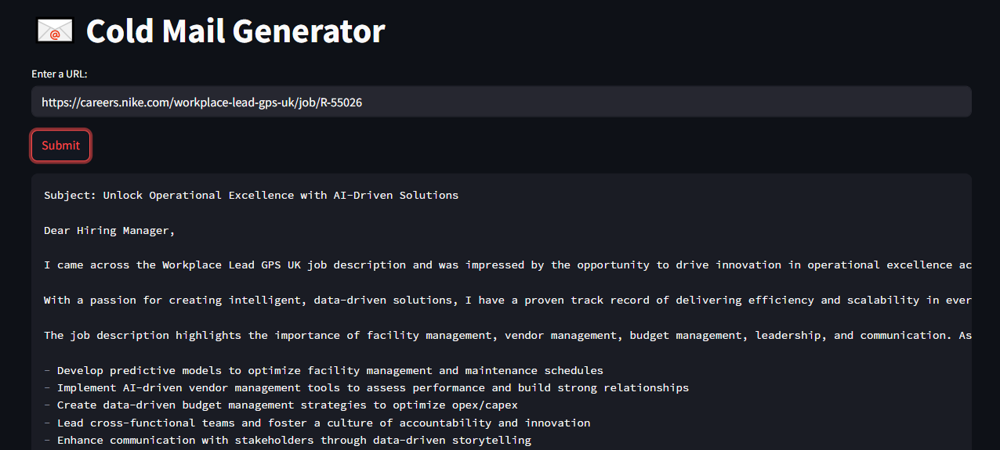

# 📧 Cold Mail Generator
Cold email generator for services company using groq, langchain and streamlit. It allows users to input the URL of a company's careers page. The tool then extracts job listings from that page and generates personalized cold emails. These emails include relevant portfolio links sourced from a vector database, based on the specific job descriptions. 

**Imagine a scenario:**

- Nike needs a Principal Software Engineer and is spending time and resources in the hiring process, on boarding, training etc
- Momina Ather is an Software/AI ENgineer who can provide a dedicated software development engineer to Nike. So, the business development executive (Momina) is going to reach out to Nike via a cold email.



## Architecture Diagram


## Set-up
1. To get started we first need to get an API_KEY from here: [https://console.groq.com/keys](https://groq.com/). Inside `app/.env` update the value of `GROQ_API_KEY` with the API_KEY you created. 


2. To get started, first install the dependencies using:
    ```commandline
     pip install -r requirements.txt
    ```
   
3. Run the streamlit app:
   ```commandline
   streamlit run app/main.py
   ```

---

## **⭐ Contribute**  
Feel free to fork this repository and contribute to its development. Pull requests are welcome!  


   

